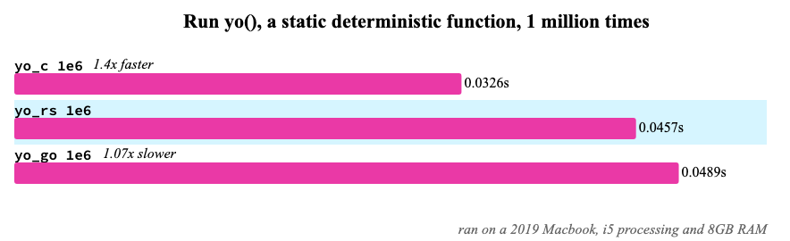
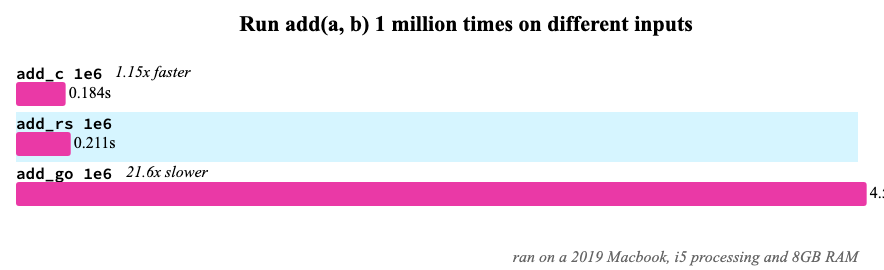
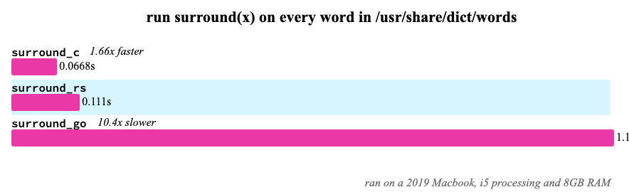
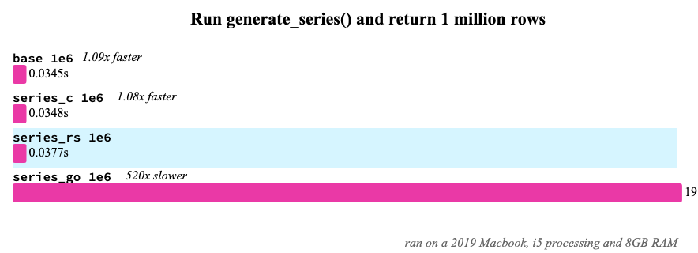

# `sqlite-loadable-rs` Benchmarks

## Benchmarks are hard

Benchmarks are hard to write, easy to game, and very seldom make a difference in day-to-day work. These benchmarks were made to ensure that SQLite extensions made with `sqlite-loadable-rs` are as fast as possible, and give as good as a performance as extensions written in C (or at least as close as possible).

These benchmarks care most about **execution time**, and not things like memory intensity, CPU load, etc.

For the Go counterparts, I used [`riyaz-ali/sqlite`](https://github.com/riyaz-ali/sqlite).

## Summary

In general, `sqlite-loadable-rs` can either be as fast or up to 10-50% slower than raw C extensions, when comparing bare-bones "hello world"-like extensions against each other. However, many real-world extensions such as [sqlite-xsv](https://github.com/asg017/sqlite-xsv) and [sqlite-regex](https://github.com/asg017/sqlite-regex) can perform _much faster_ than their C counterparts, in part to high-quality 3rd party Rust crates.

## Benchmark: "Hello world" scalar functions

If you add a new custom scalar function, how many times-per-second can I call this function in a query?

### Returning "static" strings

```sql
select yo(); -- "yo"
```



Calling `yo()` (which is a deterministic scalar function that returns the string "yo") 1 million times takes about ~45 milliseconds on my Mac using `sqlite-loadable-rs`, about 40% slower than the same extension written in C. This is partly because it requires a memory allocation in Rust to create the string every time, while the C extension uses a static string.

Caveat: This is a _deterministic_ function, so there is some form of caching that SQLite utilizes while running the benchmark. And very rarely do you call a static zero-argument SQL function a million times in a row...

### Add 2 numbers togehter

```sql
select add(1, 2); -- 3
```



Here, Rust is about 15% slower at implementing an `add()` function than C, but is ~20x faster than the same thing in Go. Here, different arguments are passed in on every interation, meaning no deterministic caching, making this a better "real-world" test.

Caveat: I'm not 100% sure why Go is so much slower here... would be happy to see others run this benchmark.

### String format



```sql
select surround('hello'); -- "xhellox"
```

This benchmark is similar to the "add" benchmark above, but involves string formatting. The `surround()` functions returns the same string with a `x` character added to the beginning and end of the string. This involves a memory allocation, and is ran on every word in `/usr/share/dict/words` (about 200k words on my Mac). `sqlite-loadable-rs` is about 66% slower than the same extension in C, probably because the C extension uses `sqlite3_mprintf` instead of Rust's `format!`, which may be faster?

## Benchmark: Virtual table implementations

If I add a virtual table or table function, how many rows-per-second can return in a query?

```sql
select value from generate_series(1, 5);
/*
┌───────┐
│ value │
├───────┤
│ 1     │
│ 2     │
│ 3     │
│ 4     │
│ 5     │
└───────┘
*/
```



Here, a `generate_series` table function was implemented in C, Go, and Rust, and called with `select count(value) from generate_series(1, 1e6)`. Essentially, this is how long it takes for a table function implementation to return 1 million rows with 1 used column, only returning integers.

The `base` script is with the builtin `generate_series` table function, and `series_c` is the same implementation but built as a seperate extension. Here, we see `sqlite-loadable-rs` perform about 9% slower than the C counterpart, which is pretty good! Although do note my `generate_series` implementation in Rust isn't 100% complete and feature compatible, but I think it should still be about 10-15% compatible in runtime performance.

Caveat: I don't know why the Go implementation is that slow. With lower numbers like `1e4` instead of `1e6` it's only 20-40x slower instead of 520x, so there may be some bugs in the underlying library.
